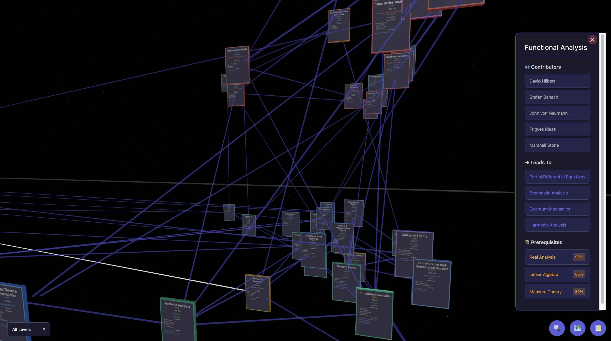

# Mathematical Cosmos 🌌🔢



An interactive 3D visualisation of mathematical topics floating in space like trading cards, connected by arrows showing how concepts build upon each other. Explore the evolution of mathematics from ancient geometry to modern machine learning.


## 🎯 Motivation

Mathematics is a vast, interconnected landscape where ideas build upon each other across centuries. Traditional linear timelines or static graphs fail to capture:

- **Temporal Evolution**: How mathematical concepts emerged and evolved over time
- **Interdependencies**: The prerequisite relationships between topics
- **Contributor Networks**: The brilliant minds behind each discovery
- **Hierarchical Structure**: The organisation of Pure vs Applied mathematics
- **Conceptual Connections**: How different areas of math naturally lead to one another

This project visualises mathematics as a living, three-dimensional cosmos where each topic is a tangible card floating in space, positioned chronologically along a timeline axis, separated vertically by type (Pure/Applied), and clustered by category. Arrows connect related concepts, allowing you to trace the intellectual lineage of mathematical ideas.

## ✨ Features

### 🌌 3D Navigation
- **Orbital Controls**: Pan, zoom, and rotate freely through the mathematical cosmos
- **Card Interaction**: Click any card to zoom in and snap it to front-camera view
- **Deep Zoom**: Zoom in very close to read card details clearly
- **Auto-Select**: Automatically zooms to the earliest topic (Logic, -350 BC) on page load
- **Smart Camera**: Smooth animations when navigating between topics

### 🎴 Rich Card Information
Each topic card displays:
- **Front Face**: 
  - Name, Year of invention/discovery
  - Difficulty badge (color-coded: High School/Undergrad/Postgrad/Research)
  - Category with color-coded border
  - Contributors list (clickable names)
  - "Leads To" topics (up to 10, clickable)
- **Back Face**: 
  - Prerequisites with strength percentages (clickable)
  - Detailed historical notes with key dates
- **Physical Depth**: Cards have 3D thickness and realistic shadows
- **Category Colors**: Border colors group topics by mathematical category

### 🔗 Advanced Arrow System
Click arrows to interact with topic relationships:
1. **First Click**: Highlights arrow in white
2. **Second Click**: Teleports to destination topic
3. **Third Click**: Teleports to source topic
4. **Fourth Click**: Deselects (returns to original color)
- **Multiple Selection**: Select multiple arrows simultaneously
- **Thickness**: Arrow thickness represents relationship strength
- **Arrow Tips**: Precisely touch card surfaces without overlapping

### 👥 Interactive Panels
- **Contributor Details**: 
  - Click contributor names to open popup with photo and dates (1607-1665)
  - Circular portrait images from Wikimedia Commons
  - Automatic fallback to initials if image unavailable
- **Topic Navigation**: 
  - Clickable "Leads To" buttons in overlay panel
  - Clickable "Prerequisites" with strength indicators
- **Navigation History**: 
  - Persistent back button (top-left) tracks entire navigation path
  - Works across all navigation methods (clicks, search, arrows, list view)
  - Stacks unlimited history of visited cards

### 🔍 Dual Search System
- **🗺️ Pathfinding Search**: 
  - Find paths between any two topics using graph traversal
  - Visualizes conceptual connections through prerequisites/leads-to
- **🔍 Quick Search**:
  - **Search Topics**: Dropdown menu to instantly teleport to any topic
  - **Search Contributors**: Find first topic associated with a mathematician
  - Alphabetically sorted for easy lookup

### 📊 Dual View Modes
- **3D Cosmos View**: 
  - Immersive spatial exploration
  - Floating cards with realistic depth
  - Starfield background with optimized small stars
- **List View**: 
  - Scrollable vertical list of all topics
  - Sort by: Year, Name, Category, Type, or Difficulty
  - Shows difficulty badges, notable years, and aliases
  - Click any card to jump back to 3D view at that topic

### 🎚️ Difficulty Filtering (3D Mode)
- **Multi-Select Filter**: Choose one or more difficulty levels simultaneously
  - 🟢 High School (green)
  - 🔵 Undergraduate (blue)
  - 🟠 Postgraduate (orange)
  - 🔴 Research (red)
- **"All Levels"**: Clears all filters to show complete cosmos
- **Visual Feedback**: Button shows "2 Levels" when filtering
- **Auto-Hide**: Arrows only visible when showing all levels

### 🌍 Visual Organization
- **Timeline Axis**: 
  - Topics arranged chronologically (-600 BC to 2010 AD)
  - Visible "TIME" label axis through the scene
  - Exponential spacing for dense modern periods
- **Pure/Applied Separation**: 
  - Pure Math below timeline axis
  - Applied Math above timeline axis
  - Clear "PURE MATH" and "APPLIED MATH" labels
- **Category Clustering**: 
  - Topics grouped by 6 mathematical categories
  - Color-coded borders (Algebra, Analysis, Geometry, Logic, Applied, Probability)
  - Spatial Z-depth creates visual groupings
- **Strategic Spacing**: 
  - Cards spaced 600 units apart on timeline
  - Triple spacing prevents overlap
  - Optimized for both desktop and mobile

## 🛠️ Tech Stack

### Frontend Framework
- **SvelteKit** (with `adapter-static`): Modern, reactive web framework for static site generation
- **JavaScript/HTML/CSS**: Core web technologies

### 3D Rendering
- **Three.js**: WebGL-powered 3D graphics library
  - OrbitControls for camera manipulation
  - Raycasting for click detection
  - Canvas textures for dynamic card content
  - MeshStandardMaterial for realistic lighting

### Data Management
- **JSON**: Structured data for topics and contributors
  - `topics.json`: 48 mathematical topics with rich metadata
    - Each topic: id, name, type, category, year, era, difficulty, aka, notableYears, notes
    - Relationships: leadsTo array, prerequisites array (with strength %)
  - `people.json`: 158+ mathematicians with biographical data
    - Each person: id, name, born/died dates, image path, gender

### Deployment
- **GitHub Pages**: Static hosting via the `docs` folder
- **`.nojekyll`**: Prevents Jekyll processing of `_app` directory

### Development Tools
- **Vite**: Fast build tool and dev server
- **Python Scripts**: Automated image fetching from Wikimedia Commons

## 📚 Data Structure

### Topics (`src/lib/data/topics.json`)
```json
{
  "id": "calculus",
  "name": "Calculus",
  "type": "Pure Math",
  "category": "Analysis",
  "year": 1665,
  "era": { "start": 1665, "peak": 1750, "end": null },
  "difficulty": "UGrad",
  "aka": ["Infinitesimal Calculus"],
  "notableYears": [1665, 1687, 1734],
  "notes": "Independently developed by Newton (1665) and Leibniz (1675-76); Newton's Principia (1687); Euler's formalization (1734).",
  "leadsTo": ["differential-equations", "real-analysis"],
  "contributors": ["newton", "leibniz", "euler"],
  "prerequisites": [
    { "id": "trigonometry", "strength": 70 },
    { "id": "elementary-algebra", "strength": 85 }
  ]
}
```

**Difficulty Levels**:
- `"High School"`: Elementary topics (Geometry, Algebra, Trigonometry)
- `"UGrad"`: Undergraduate level (Calculus, Linear Algebra, Diff Equations)
- `"PGrad"`: Graduate level (Functional Analysis, Algebraic Topology, Galois Theory)
- `"Research"`: Advanced research topics (Category Theory, Homological Algebra)

### People (`src/lib/data/people.json`)
```json
{
  "id": "newton",
  "name": "Isaac Newton",
  "born": 1643,
  "died": 1727,
  "image": "/images/people/newton.jpg",
  "gender": 1
}
```

**Image Paths**: All images use `/images/people/` which maps to `static/images/people/` in the project. During build, SvelteKit copies these to `docs/images/people/` for GitHub Pages deployment. The component automatically converts absolute paths to relative paths (`./images/people/`) for proper GitHub Pages compatibility.

## 🚀 Getting Started

### Prerequisites
- Node.js (v18 or higher)
- npm or pnpm

### Installation

```bash
# Clone the repository
git clone https://github.com/abaj8494/math-map.git
cd math-map

# Install dependencies
npm install
```

### Development

```bash
# Start the development server
npm run dev

# Open your browser to http://localhost:5173
```

### Building for Production

```bash
# Build the static site
npm run build

# Preview the production build locally
npm run preview

# Deploy (the built site is in the docs/ folder)
git add docs/
git commit -m "Update build"
git push origin main
```

## 🎮 Usage Guide

### 🖱️ Mouse/Touch Controls
- **Left Click + Drag**: Rotate the view around the scene
- **Right Click + Drag**: Pan the camera position
- **Two-Finger Drag** (mobile): Pan the camera
- **Scroll** or **Pinch**: Zoom in/out (can zoom very close)
- **Single Click on Card**: Snap to front-camera view of that topic
- **Click on Distant Card**: Works even for cards on the far horizon

### 🎯 Arrow Interactions
- **1st Click**: Highlight arrow white
- **2nd Click**: Teleport to destination topic
- **3rd Click**: Teleport back to source topic
- **4th Click**: Deselect arrow (returns to blue)
- You can select multiple arrows simultaneously!

### 🎛️ Interface Elements
- **🗺️ Pathfinding** (bottom-right): Find conceptual paths between topics
- **🔍 Quick Search** (left of pathfinding): 
  - Dropdown menus to instantly jump to topics or contributors
- **📋 List View** (bottom-right): Switch to scrollable list with sorting
- **Difficulty Filter** (bottom-left): Multi-select filter (3D mode only)
  - Shows "All Levels" or "2 Levels" based on selection
  - Click to open dropdown with checkboxes
- **← Back** (top-left, appears after navigation): 
  - Returns to previous card in history
  - Tracks unlimited navigation history
- **✕ Close** (overlay top-right): Close detail panel

### 📚 Exploring Topics

**Starting Out:**
1. On page load, you'll automatically zoom to **Logic** (-350 BC), the earliest topic
2. Use orbit controls to look around the cosmos

**Detailed Exploration:**
1. **Click a card** to zoom in and snap it to front view
2. **Read the front**: 
   - Title, year, difficulty badge, category
   - Contributors (click names for photos/dates)
   - "Leads To" topics (click to teleport)
3. **Rotate to see the back** (right-click drag):
   - Prerequisites with strength percentages (click to navigate)
   - Historical notes with key dates and events
4. **Use back button** to return to previous cards in your journey
5. **Click arrows** to highlight relationships and teleport along connections

**Filtering & Search:**
1. **Difficulty Filter**: Show only High School topics, or combine UGrad + PGrad
2. **Quick Search**: Type or select from dropdown to instantly find topics
3. **Pathfinding**: Discover how to get from "Geometry" to "Machine Learning"

**List View:**
1. Click 📋 to switch to list mode
2. Sort by Year, Name, Category, Type, or Difficulty
3. Browse through cards with full metadata
4. Click any card to jump back to 3D view at that location

## 📸 Adding Contributor Images

The project includes Python scripts (adapted from `shrine-svelte-ref`) to automatically fetch images from Wikimedia Commons:

```bash
cd src/lib/data

# Ensure the script exists (get_img.py)
# Install dependencies
pip install requests tqdm Pillow

# Run the image fetcher
python3 get_img.py
```

**How it works:**
1. Reads `people.json` to get contributor names
2. Looks up each person's Wikipedia page
3. Finds their Wikidata Q-ID via MediaWiki API
4. Downloads their portrait from Wikimedia Commons
5. Saves images to `static/images/people/`

**Image Requirements:**
- Place all images in `static/images/people/` (NOT `src/lib/data/`)
- Use relative paths: `/images/people/name.jpg` in `people.json`
- Supported formats: JPG, PNG
- Images automatically converted to circular avatars in UI
- Fallback to initials if image unavailable

**Current Status**: 24/158 contributors have images. Contributions welcome!

## 🤝 Contributing

We welcome contributions! Areas that need work:

### High Priority
- **Missing Images**: 134 contributors still need photos (use `get_img.py`)
- **Topic Additions**: Expand beyond 48 topics (missing: Game Theory, Knot Theory, etc.)
- **Relationship Accuracy**: Verify "leads to" and prerequisite connections
- **Historical Notes**: Expand notes with more context and key dates
- **Missing Contributors**: Some topics reference mathematicians not yet in `people.json`

### Medium Priority
- **Difficulty Calibration**: Verify difficulty levels (High School/UGrad/PGrad/Research)
- **Era Refinement**: Improve start/peak/end dates for mathematical eras
- **Alias Expansion**: Add more "aka" (also known as) terms for searchability
- **Notable Years**: Add key dates for major breakthroughs

### Low Priority
- **Mobile Optimization**: Improve touch controls and responsive layout
- **Performance**: Optimize for scenes with 100+ topics
- **Accessibility**: Improve screen reader support and keyboard navigation
- **Bug Fixes**: Report and fix any issues you find

### Adding a New Topic

1. Edit `src/lib/data/topics.json`
2. Follow the existing structure (see "Data Structure" section)
3. Required fields: `id`, `name`, `type`, `category`, `year`, `era`, `difficulty`
4. Optional fields: `aka`, `notableYears`, `notes`, `leadsTo`, `contributors`, `prerequisites`
5. Ensure all `contributors` exist in `people.json` (add them if not)
6. Ensure all `prerequisites` and `leadsTo` reference valid topic IDs
7. Choose appropriate difficulty: High School/UGrad/PGrad/Research
8. Test in development mode (`npm run dev`)
9. Build and verify (`npm run build && npm run preview`)
10. Submit a pull request!

### Adding a New Contributor

1. Edit `src/lib/data/people.json`
2. Required fields: `id`, `name`, `born`, `died`, `image`, `gender`
3. Use kebab-case for `id` (e.g., `"pierre-de-fermat"`)
4. Image path: `/images/people/lastname.jpg` (or firstname if clearer)
5. Add actual image file to `static/images/people/`
6. Or run `get_img.py` to auto-fetch from Wikimedia Commons
7. Test that popup displays correctly
8. Submit PR with both JSON and image!

## 📝 License

This project is open source and available under the MIT License.

## 🙏 Acknowledgments

- **Wikimedia Commons**: For providing freely accessible portraits
- **Three.js Community**: For excellent 3D graphics tools
- **Mathematical Community**: For centuries of brilliant discoveries
- **shrine-svelte-ref**: For the image fetching infrastructure

## 🔗 Links

- **Live Demo**: [https://abaj8494.github.io/math-map/](https://abaj8494.github.io/math-map/)
- **Repository**: [https://github.com/abaj8494/math-map](https://github.com/abaj8494/math-map)
- **Issues**: [https://github.com/abaj8494/math-map/issues](https://github.com/abaj8494/math-map/issues)

---

**Built with ❤️ by mathematicians, for mathematicians**
